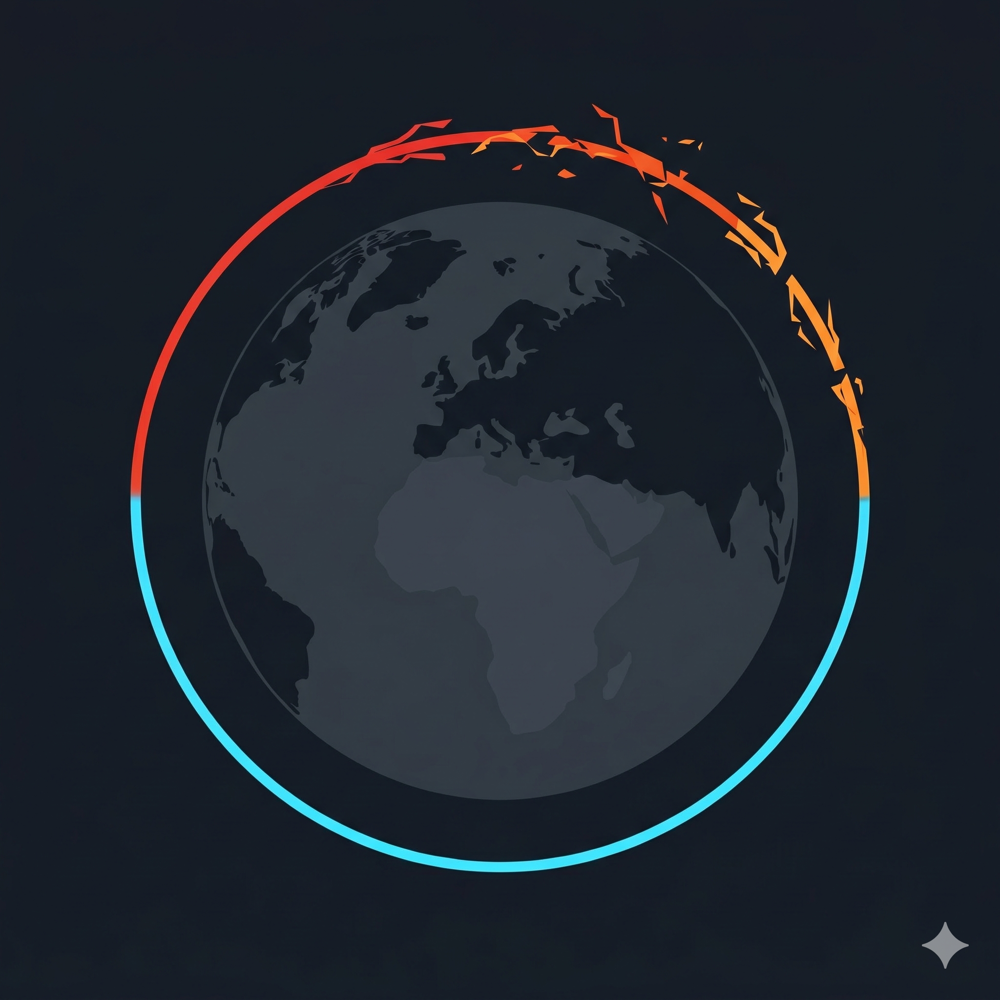

# Project Charta
## Context and Scope

**Domäne:** Öffentliche Verwaltung, Klimapolitik, Staatstransparenz

Die Schweizer Bundesverwaltung betreibt einen Lufttransportdienst des Bundes (LTDB), der Bundesratsmitgliedern und weiteren Behördenvertretern Flugreisen im In- und Ausland ermöglicht. Flugreisen stellen mit **61 Prozent** den mit Abstand grössten Hotspot der Treibhausgasemissionen (THG-Emissionen) der Bundesverwaltung dar (RUMBA-Umweltbericht 2024). 2023 beliefen sich die Emissionen aus Flugreisen laut RUMBA-Umweltbericht 2024 auf 16'904 Tonnen CO₂-Äquivalente.

**Thematische Aspekte:**

- Wer fliegt mit dem Bundesratsjet wohin und wann?
- Wie haben sich die Emissionen der Bundeskanzleisflüge über die Zeit entwickelt?
- Welchen Anteil haben die BR-Jets und -Helikopter an den Gesamtemissionen der Bundesverwaltung?
- Kann ein Impact durch einen Vergleich mit Emissionsberichten anderer Regierungen oder Institutionen abgeschätzt werden?
- Wie vergleicht sich ein normaler Bürger / eine normale Bürgerin mit den Emissionen einer Person der Bundeskanzlei?

**Leitfragen:**

1. Welche Reisemuster (Personen, Destinationen, Häufigkeit) lassen sich aus den Flugdaten der Bundeskanzlei (2020–2024) ablesen?
2. Wie haben sich die THG-Emissionen der Bundeskanzleisflüge seit 2019 entwickelt und ist die Bundesverwaltung auf Kurs zur Erreichung des Reduktionsziels (–30% bis 2030)?
3. Wie vergleichen sich die Gesamtemissionen der Bundesverwaltung mit den Emissionen anderer Regierungen oder Institutionen?

**Veröffentlichung:** Öffentlich zugängliche, scrollbare Data Story (Website, GitHub Pages), und Dokumentation mit Quarto.

**Datenquellen:**

- Flugdaten der Bundeskanzlei 2020–2024 (Excel, [bk.admin.ch](https://www.bk.admin.ch/bk/de/home/dokumentation/medienmitteilungen/flugdaten_bk.html))
- RUMBA – Umweltberichte 2021–2024, GS-UVEK, mit THG-Emissionen Flugreisen je Berichtsjahr
- Flüge des Bundesrates mit dem Lufttransportdienst ([admin.ch](https://www.admin.ch/gov/de/start/bundesrat/aufgaben-des-bundesrates/flugreisen.html))

## Project Objectives and Success Criteria

**Projektziele (aus Stakeholder-/Nutzerperspektive):**

1. **Transparenz schaffen:** Interessierten Bürgerinnen und Bürgern sowie Medienschaffenden ermöglichen, schnell und intuitiv zu verstehen, wer mit dem Bundesratsjet fliegt, wohin und wie oft.
2. **Klimaimpact kommunizieren:** Die CO₂-Emissionen der Bundesratsflüge verständlich einordnen und im Zeitverlauf (2019–2024) sowie im Vergleich zu anderen Emissionsquellen der Bundesverwaltung darstellen.
3. **Zielfortschritt aufzeigen:** Den Fortschritt gegenüber dem Aktionsplan Flugreisen (–30% bis 2030 gegenüber 2019) visualisieren.

**Erfolgskriterien:**

| Kriterium | Qualitativ | Quantitativ (Zielwert) |
|---|---|---|
| Verständlichkeit | Laien können Kernaussagen ohne Vorwissen erfassen | Mind. 2 Personas abgedeckt |
| Vollständigkeit | Alle 5 Datenjahre (2020–2024) dargestellt | 100% der verfügbaren Flugdaten integriert |
| Visualisierungsqualität | Klare visuelle Hierarchie, konsistentes Design | Mind. 3 unterschiedliche Diagrammtypen |
| Narrativer Fluss | Data Story führt Lesende durch die Kernbotschaften | Mind. 4 klar strukturierte Story-Kapitel |
| Reproduzierbarkeit | Code und Daten sind dokumentiert und nachvollziehbar | Vollständig in Quarto/Git versioniert |

**Explizit ausgeschlossen (Out of Scope):**

- Systematischer Ländervergleich oder politische Bewertung anderer Regierungen (punktuelle Einordnung anhand öffentlich verfügbarer Emissionsberichte vergleichbarer Institutionen ist hingegen im Scope)
- Emissionen aus anderen Dienstreisekategorien (Bahn, Auto) der Bundesverwaltung
- Echtzeit-Flugtracking oder Live-Daten
- Normative Bewertung einzelner Reisen oder Personen


## Stakeholder Analysis

| Stakeholder | Interesse / Ziele | Beziehung zum Projekt |
|---|---|---|
| Schweizer Bevölkerung / Steuerzahlende | Transparenz über staatliche Ausgaben und Klimawirkung | Primäre Zielgruppe |
| Medienschaffende / Investigativjournalismus | Recherche-Grundlage, Faktenchecks, Berichterstattung | Sekundäre Zielgruppe. Mögliche Multiplikatoren |
| Umwelt- und Klimaorganisationen | Belege für klimapolitische Forderungen | Sekundäre Nutzer, mögliche Fürsprecher |
| Bundeskanzlei (BK) | Transparenz und Rechenschaftspflicht. Datenquelle | Datenlieferant (öffentl. PDFs) |
| Fachstelle RUMBA / GS-UVEK | Kommunikation von Klimazielen und -fortschritten | Datenlieferant (RUMBA-Umweltbericht) |
| Bundesratsmitglieder / Departemente | Rechenschaftspflicht. Reputation | Indirekt betroffen |
| Studierende / Forschende | Lernprojekt, Methodenkompetenz Datenvisualisierung | Projektteam |

**Stakeholder-Map (vereinfacht):**

```
                    [RUMBA/GS-UVEK]
                          |
  [Umweltorganisationen]--+--[Bundeskanzlei]
                          |
           [Bevölkerung]--+--[Medienschaffende]
                          |
                    [Bundesrat/Depts]
                          |
                    [Data Story]
```


## User Analysis

### Persona: Lea, interessierte Bürgerin (35, Zürich)
::: {#fig-persona}
{width=50% fig-align="left"}

Mit Nano Banana von Gemini erstelltes Persona-Porträt. 
:::
**Profil:** Lehrerin, politisch interessiert, liest regelmässig Tamedia-Medien und SRF-Online. Keine Fachkenntnisse in der Datenanalyse. Nutzt Smartphone und Laptop gleichermässig.

**Domänenexpertise:** Gering (kennt den Bundesrat, weiss wenig über LTDB oder RUMBA)
**Data Literacy:** Gering bis mittel (versteht einfache Balken- und Liniendiagramme)
**Technisches Umfeld:** Smartphone-first, Chrome/Safari, gelegentlich Desktop
**Nutzungsfrequenz:** Einmalig / gelegentlich (bei medialem Anlass)

**User Tasks (Jobs):**
- *Funktional:* Schnell verstehen, ob der Bundesrat "zu viel" fliegt und wie viel CO₂ dabei entsteht.
- *Sozial:* Informiert mitreden können, z.B. in Gesprächen über Klimapolitik.
- *Emotional:* Sich als mündige Bürgerin informiert und nicht "ausgetrickst" fühlen.

**Pains:**
- Rohdaten in PDF-Form sind unzugänglich und schwer interpretierbar.
- Fehlender Kontext: Sind 15'000 t CO₂ viel oder wenig?
- Überfrachtete Darstellungen mit zu viel Fachjargon.

**Gains:**
- Klare Kernbotschaft auf einen Blick erkennbar.
- Vergleiche, die Grössenordnungen greifbar machen (z.B. Äquivalente in Autofahrten oder Flügen pro Person).
- Interaktive Elemente, um selbst nach Departement und Destination zu suchen (Einzelnamen sind in den Daten nicht enthalten).

---

### Anti-User-Persona: Marc, Datenjournalist (42, Bern)
::: {#fig-antipersona}
{width=50% fig-align="left"}

Mit Nano Banana von Gemini erstelltes Anti-Persona-Porträt. 
:::
**Profil:** Journalist bei einer Schweizer Tageszeitung, spezialisiert auf Recherchen zu Politik und Verwaltung. Erfahren im Umgang mit Daten und Tabellen. Nutzt Desktop und Laptop.

**Domänenexpertise:** Hoch (kennt RUMBA, Klimaziele der Bundesverwaltung, Aktionsplan Flugreisen)
**Data Literacy:** Hoch (liest Diagramme, versteht Methodik, hinterfragt Datenquellen)
**Technisches Umfeld:** Desktop-first, mehrere Browser, braucht zitierfähige Quellen
**Nutzungsfrequenz:** Wiederkehrend (bei jährlichen RUMBA-Updates oder politischen Ereignissen)

**User Tasks (Jobs):**
- *Funktional:* Einzelne Flüge und Passagiere schnell auffindbar machen. Zeitliche Trends identifizieren. Abweichungen vom Zielpfad erkennen.
- *Sozial:* Recherche-Ergebnisse gegenüber Redaktion und Publikum belegen.
- *Emotional:* Sicherheit haben, dass die Daten korrekt und vollständig dargestellt sind.

**Pains:**
- Mühsames manuelles Auslesen der PDF-Flugdaten.
- Fehlende Verknüpfung von Einzelflügen mit aggregierten Emissionsdaten.
- Unklare Methodik (wie werden Emissionen der BR-Jets berechnet vs. Linienflüge?).

**Gains:**
- Alle Flüge durchsuchbar und filterbar (nach Jahr, Departement, Destination. Einzelnamen sind in den veröffentlichten Flugdaten nicht enthalten).
- Direktlinks zu Originaldatenquellen (Bundeskanzlei-PDFs, RUMBA-Bericht).
- Exportmöglichkeit oder klar dokumentierte Methodik für Weiterverarbeitung.

---

### Non-Human Persona: Das Klima
::: {#fig-nonhumanpersona}
{width=50% fig-align="left"}

Mit Nano Banana von Gemini erstelltes Non-Human-Persona Bild. 
:::
**Profil:** Globales, physikalisch-chemisches System, das durch kumulierte Treibhausgasemissionen destabilisiert wird. Kein Bewusstsein, aber klare messbare Zustände und Schwellenwerte. «Nutzt» die Data Story nicht aktiv, ist jedoch das zentrale betroffene System hinter allen dargestellten Daten.

**Zustand (Referenzpunkt 2024):** Globale Erwärmung +1,3 °C gegenüber vorindustriellem Niveau. Schweiz ist überproportional betroffen (+2,8 °C seit 1864). Restliches CO₂-Budget bis 1,5 °C-Ziel (IPCC AR6): ca. 250 Gt CO₂ global.

**Systemrelevante Kennzahlen:**
- Emissionen Bundesverwaltung Flugreisen 2024: 15'220 t CO₂eq
- Anteil BR-Jets an Gesamtemissionen Bundesverwaltung: klein, aber symbolisch hochrelevant
- Zielpfad Bundesverwaltung: –30% Flugemissionen bis 2030 gegenüber 2019

**«Interests» (systemische Bedürfnisse):**
- *Physikalisch:* Jede vermiedene Tonne CO₂eq verringert die kumulierte Strahlungserwärmung. Auch kleine institutionelle Emissionsquellen zählen zur Gesamtbilanz.
- *Politisch-systemisch:* Vorbildwirkung staatlicher Akteure beeinflusst gesellschaftliche Normen und politische Handlungsspielräume. Sichtbare Daten erhöhen den Anpassungsdruck.
- *Zeitlich:* Das Klima reagiert träge (CO₂-Verweilzeit: 100–300 Jahre). Entscheidungen heute haben Konsequenzen weit über den Zeithorizont der Data Story hinaus.

**Pains:**
- Emissionen werden nicht reduziert, weil sie unsichtbar oder abstrakt bleiben (fehlende Datentransparenz).
- Symbolische Emissionsquellen (BR-Jets) werden politisch nicht adressiert, weil aggregierte Zahlen keinen Handlungsdruck erzeugen.
- Zielpfade existieren auf dem Papier, ohne nachvollziehbares Monitoring.

**Gains:**
- Öffentliche Sichtbarkeit der Einzelflug-Emissionen erhöht gesellschaftlichen und politischen Druck zur Verhaltensänderung.
- Visualisierter Abstand zum –30%-Ziel macht Handlungsbedarf konkret und verhandelbar.
- Vergleichsinfografiken (z.B. t CO₂ pro Kopf oder Äquivalente) übersetzen abstrakte Tonnenzahlen in greifbare Realität und stärken das Klimabewusstsein.


## Situation Assessment

**Verfügbare Daten:**

| Quelle | Inhalt | Format | Zeitraum | Einschränkungen |
|---|---|---|---|---|
| Bundeskanzlei (bk.admin.ch) | Flüge LTDB inkl. Mitreisende (Name, Funktion, Destination, Datum) | Excel (RUMBA-Fluglisten) | 2020–2024 | Emissionswerte nicht direkt enthalten. Distanz pro Abschnitt bereits berechnet. Keine Personennamen in den Daten |
| RUMBA Umweltberichte 2021–2024 | THG-Emissionen Bundesverwaltung gesamt und nach Kategorie inkl. Flugreisen. BR-Jets/Helikopter separat | PDF (Diagramme) | 2020–2023 (je Bericht ein Datenjahr) | Aggregierte Jahreswerte. Keine Einzelflug-Emissionen. 2024er Daten noch nicht publiziert |
| admin.ch Flugreisen | Kontext, Regeln, Aktionsplan | Webseite | Aktuell | Wenig quantitative Daten |

**Personal:** 2 Studierende (Semesterarbeit)

**Software/Tools:**
- Python (PDF-Extraktion, Datenaufbereitung: `pdfplumber`, `pandas`)
- Git / GitHub (Versionierung)
- Figma oder Quarto-Theming (Design)

**Zeit:** Frühlingssemester 2026 (09. März bis 05. Juni 2026)

**Risiken:**

| Risiko | Wahrscheinlichkeit | Impact | Massnahme |
|---|---|---|---|
| Flugdaten-PDFs sind schlecht maschinenlesbar | Hoch | Mittel | Frühe Extraktion testen. Manuelle Nachbearbeitung einplanen |
| Emissionsdaten für BR-Jets nicht granular genug | Mittel | Mittel | Aggregierte RUMBA-Werte nutzen. Methodik transparent dokumentieren |
| Datenlücken vor 2020 (keine Einzelflug-Excel-Daten) | Gering | Gering | Flugdaten 2020 vorhanden (Excel). RUMBA-Zeitreihe ergänzt Trend ab 2019 |
| Zeitaufwand für PDF-Extraktion unterschätzt | Mittel | Hoch | Datenakquise priorisieren. Aufwand früh abschätzen |


## Visualization Concept

### Produkt: Scrollbare Data Story

Die Data Story führt Lesende durch eine Hero-Sektion und sechs narrative Kapitel (Kapitel 0–5): von den begrifflichen Grundlagen über die Einordnung, die Flugmuster und den Emissionstrend bis zum institutionellen Vergleich und dem persönlichen Bezug. Das Format adressiert primär Persona 1 (Lea, Bürgerin), berücksichtigt mit institutionellem Vergleich und persönlichem Bezug jedoch auch weitere im Dokument definierte Perspektiven und (Anti-)Personas.

---

### Kapitelstruktur und Visualisierungen

**Hero – Aufmacher der Story**
- *Visualisierung:* Interaktiver 3-D-Globus (eigenes WebGL-Modul, `app/lib/globe.py`) mit den Top-Routen ab Schweizer Flughäfen. Daneben ein Big-Number-Tile mit der berechneten Jahresmenge CO₂eq und einer dazu gestellten Vergleichszahl aus dem offiziellen RUMBA-Bericht. Der Tooltip erklärt die Methodendiskrepanz.
- *Narrativ:* Provokante Einstiegsfrage: «Wie viel CO₂ verursacht die Schweizer Regierung auf Reisen?»
- *Interaktivität:* Jahresauswahl per `st.radio` (alle Datenjahre 2020–2024). Aktualisiert Globus und Big-Number-Tile simultan.
- *Wert:* Sofortige Orientierung. Ehrliche Einordnung der Methodendifferenz zwischen berechneten Werten und dem offiziellen RUMBA-Total.

**Kapitel 0 – Grundlagen zu den RUMBA-Umweltberichten**
- *Visualisierung:* Drei KPI-Kacheln (Umfang, Organisation, neue Themen) plus ein erläuternder Callout zum Klimapaket Bundesverwaltung und Aktionsplan Flugreisen.
- *Narrativ:* Was misst RUMBA? Welche Einheiten sind erfasst (sechs Departemente, Bundeskanzlei und Parlamentsdienste. Das VBS läuft separat in RUMS-VBS). Was kommt ab Bericht 2025 neu hinzu (Kältemittel, Satellit-Themen)?
- *Wert:* Schafft die konzeptuelle Grundlage, damit nachfolgende Zahlen korrekt interpretierbar sind.

**Kapitel 1 – Einleitung: Die Flüge der Bundesverwaltung im Kontext**
- *Visualisierung:* Einzelkennzahl-Kacheln (Big Numbers) aus `RUMBA_KEY_FIGURES`: Gesamtemissionen Bundesverwaltung, Anteil Flugreisen (36–61 %), Emissionen Flugreisen pro Berichtsjahr.
- *Interaktivität:* RUMBA-Berichtsjahr per `st.radio`. Alle Kennzahlen in den Kacheln aktualisieren sich gemeinsam.
- *Narrativ:* Verortet die Flugemissionen als grössten Hotspot innerhalb der Gesamtbilanz.
- *Wert:* Schafft sofort Relevanz und Grössenordnung (kommunikativer Wert).

**Kapitel 2 – Wer fliegt wohin? (2020–2024)**
- *Visualisierung:* Interaktiver 3-D-Globus (eigenes WebGL-Modul, `app/lib/globe.py`) mit Flugverbindungen ab Schweizer Flughäfen. Plotly-Arc-Map (Scattergeo) dient als Fallback, falls die Globus-Daten leer sind. Ergänzt durch eine durchsuchbare Tabelle der Einzelflüge.
- *Narrativ:* «Welche Destinationen wurden am häufigsten angeflogen?»
- *Interaktivität:* Drei gekoppelte Filter (Jahr, Departement, **Zielland**) per `st.selectbox`, wirken simultan auf Globus und Tabelle. Hinweis: Einzelnamen sind in den veröffentlichten RUMBA-Flugdaten nicht enthalten.
- *Wert:* Ermöglicht geografische Mustererkennung (kognitiv-analytisch). Macht Flugaktivität konkret erfahrbar (kommunikativer Wert).

**Kapitel 3 – Zeitliche Entwicklung der Emissionen**
- *Visualisierung:* Liniendiagramm der offiziellen RUMBA-Flugemissionen (2019–2024) mit Zielpfad (–30 % bis 2030, Aktionsplan Flugreisen). 2020 wird als COVID-Sondereffekt markiert. 2024 ist der jüngste offizielle RUMBA-Wert.
- *Schrittnavigation:* Sieben Narrativ-Schritte (von 2019-Basisjahr über die jährlichen Stationen bis 2024-Trendwende und 2025-Forecast / 2030-Ziel). Gesteuert über Prev/Next-Buttons. Die aktuelle Position wird in `st.session_state["ch3_step_index"]` persistiert. Jeder Schritt rendert eine Karte mit Heading und Detailtext neben dem Diagramm.
- *Annotation:* 2019-Basisjahr (20'200 t, abgeleitet aus RUMBA 2024), «auf Zielkurs»-Status (RUMBA 2025).
- *Narrativ:* «Ist die Bundesverwaltung auf Kurs?»
- *Wert:* Offizielle Zeitreihe und Zielfortschritt schrittweise erzählt. Differenzierte Botschaft statt einzelner Headline (kognitiv-analytisch und kommunikativ).

**Kapitel 4 – Im Vergleich: Vereinigtes Königreich**
- *Visualisierung:* Indizierter Linienvergleich CH Bundesverwaltung vs. UK Central Government (Greening Government Commitments Report). Flankiert von einer Markdown-Tabelle mit den wichtigsten Policy-Unterschieden.
- *Narrativ:* «Wie schneidet die Schweizer Bundesverwaltung im Vergleich ab?»
- *Einschränkungshinweis:* Kaum eine andere Regierung publiziert vergleichbare Daten öffentlich. Die Datenlücke wird als eigenständiger Befund kommuniziert. Methodische Unterschiede zwischen CH und UK werden transparent ausgewiesen.
- *Wert:* Kontextualisiert die Schweizer Zahlen. Die fehlende Vergleichbarkeit macht die Ausnahmestellung öffentlicher Berichterstattung sichtbar (kognitiv-analytischer Wert).

**Kapitel 5 – Was bedeutet das für mich? (Bürger-Vergleich)**
- *Visualisierung:* Interaktiver Pro-Kopf-Rechner mit zwei Modi (`st.tabs`):
  - *Light:* `st.number_input` für die Anzahl typischer Flüge.
    - *Advanced:* `st.data_editor` mit editierbarer Routen-Tabelle (IATA-Abflug, IATA-Ziel, Anzahl, Klasse Economy/Business). Distanzen via Haversine aus dem Airport-Lookup. Emissionen via myClimate-Faktoren.
- *Vergleichswert:* Durchschnittliche Pro-Kopf-Emission eines BK-Mitarbeitenden, hochgerechnet aus der Jahressumme über eine fix verdrahtete Belegschafts-Annahme (`n_staff_estimate = 5'000`).
- *Narrativ:* «Wie viele «Durchschnittsbürger:innen» bräuchte es, um die Emissionen einer Person der Bundeskanzlei zu erreichen?»
- *Wert:* Macht abstrakte Tonnenzahlen mit persönlichem Bezug greifbar. Schafft emotionalen Anknüpfungspunkt (Erfahrungs- und kommunikativer Wert).

---

### Visuelle Encodings

| Diagrammtyp | Einsatz | Begründung |
|---|---|---|
| 3-D-Globus (WebGL, eigenes Modul) | Flugverbindungen Hero + Kap. 2 | Geografische Muster mit räumlicher Tiefe. Drehung weckt Aufmerksamkeit |
| Arc-Map (Plotly Scattergeo) | Fallback für Hero + Kap. 2 | Robuste 2-D-Darstellung, wenn Globus-Daten leer sind |
| Big Number / KPI-Kacheln | Hero + Kap. 0 + Kap. 1 | Sofortige Orientierung ohne Diagramm-Aufwand |
| Liniendiagramm + Zielpfad | Emissionstrend 2019–2024 RUMBA (Kap. 3) | Zeitlicher Verlauf und Zielfortschritt |
| Schritt-Karten (HTML-Cards) | Narrativ-Begleitung Kap. 3 | Storytelling neben dem Diagramm. Ein Befund pro Karte |
| Durchsuchbare Tabelle | Einzelflüge (Kap. 2) | Tiefere Exploration der Rohdaten |
| Indizierter Linienvergleich | CH vs. UK Institutionenvergleich (Kap. 4) | Vergleich relativer Entwicklungen über die Zeit |
| Editierbare Routen-Tabelle (`st.data_editor`) | Pro-Kopf-Rechner Kap. 5 (Advanced) | Direkte Manipulation: Lesende geben eigene Flüge ein |

---

### Interaktivität

- Hero: Jahresauswahl (`st.radio`) steuert Globus und Big-Number-Tile.
- Kapitel 1: Auswahl des RUMBA-Berichtsjahrs (`st.radio`), aktualisiert alle KPI-Kacheln.
- Kapitel 2: Filterpanel mit drei `st.selectbox`-Filtern (Jahr, Departement, **Zielland**) für Globus und Tabelle.
- Kapitel 3: Prev/Next-Buttons zur Schrittnavigation. Position persistiert in `st.session_state["ch3_step_index"]`.
- Kapitel 5: Modus-Umschaltung per `st.tabs` (Light / Advanced). Editierbare Routen-Tabelle (`st.data_editor`).
- Tooltips auf allen Plotly-Diagrammen mit Detailwerten.
- Annotationen im Liniendiagramm (Basisjahr, RUMBA-Status).

---

### Zielmedium

Öffentlich zugängliche Webseite (Streamlit / Quarto-HTML), optimiert für Desktop und Tablet. Mobile Darstellung vereinfacht (Karte deaktiviert, Tabelle kollabiert).

---

### Mapping auf Projektziele und Nutzerbedürfnisse

| Ziel / Nutzerbedürfnis | Wie adressiert |
|---|---|
| Transparenz (Lea: «wer fliegt wohin») | Globus + Tabelle Kapitel 2 (Filter Jahr / Departement / Zielland) |
| Konzeptuelle Grundlage (Was ist RUMBA?) | KPI-Kacheln und Callout Kapitel 0 |
| Klimaimpact einordnen (Lea: Kontext) | Big Numbers Kap. 1 + Pro-Kopf-Rechner Kap. 5 |
| Zeittrend und Zielfortschritt (Lea, Klima) | Liniendiagramm Kapitel 3 mit Zielpfad und Schritt-Narrativ |
| Institutionenvergleich (Leitfrage 3) | Indizierter Linienvergleich CH vs. UK Kapitel 4 |
| Persönlicher Bezug (Lea: «Was bedeutet das für mich?») | Pro-Kopf-Rechner Kapitel 5 (Light / Advanced) |
| Methodik und Quellenvertrauen | Dokumentierter Code, Quellenverweis im Footer |


## Project Plan

```{mermaid}
%%| label: fig-project-plan
%%| fig-cap: Vorläufiger Projektplan als Gantt-Diagramm.
gantt
    title Projektplan Frühlingssemester 2026
    dateFormat YYYY-MM-DD
    tickInterval 7day
    section Projektverständnis
        Kontextanalyse und Datenquellen sichten     :a1, 2026-03-09, 3d
        Stakeholder- und Nutzeranalyse              :a2, 2026-03-10, 4d
        Situationsanalyse und Risikobeurteilung     :a3, 2026-03-13, 2d
        Visualisierungskonzept                      :a4, 2026-03-16, 2d
        Projektcharta unterzeichnen: milestone, m1, 2026-03-20, 1d

    section Datenakquise und -exploration
        Excel-Datenaufbereitung Flugdaten 2020–2024  :a5, 2026-03-23, 5d
        Datenbereinigung und -strukturierung        :a6, 2026-03-26, 4d
        Explorative Datenanalyse                    :a7, 2026-03-30, 4d
        Datenbericht besprechen: milestone, m2, 2026-04-03, 1d

    section Visuelle Encodierung und Design
        Karte Flugdestinationen                     :a8, 2026-04-06, 7d
        Emissionstrend-Diagramme                    :a9, 2026-04-09, 7d
        Durchsuchbare Tabelle implementieren        :a10, 2026-04-14, 5d
        Data Story Prototyp (Quarto)                :a11, 2026-04-20, 10d
        Visualisierungsbericht abschliessen         :a12, 2026-05-04, 3d

    section Evaluation
        Präsentation vorbereiten                    :a13, 2026-05-18, 5d
        Projektpräsentation: milestone, m3, 2026-06-05, 1d
```

Siehe [Mermaid Syntax für Gantt-Diagramme](https://mermaid.js.org/syntax/gantt.html). Wird in Safari möglicherweise nicht korrekt angezeigt → Chrome verwenden. [Live-Editor mit Exportfunktion](https://mermaid.live/)


## Roles and Contact Details

| Rolle | Person | Aufgaben | Kontakt |
|---|---|---|---|
| Studierende/r | L. Locarnini | Datenakquise, Visualisierung, Data Story, Dokumentation | locarlil@students.zhaw.ch |
| Studierende/r | A. Wyder | Datenbereinigung, Visualisierung, Data Story, Dokumentation | wyderali@students.zhaw.ch |
| Betreuung / Auftraggeber | M. Döhmer | Fachliche Begleitung, Feedback, Abnahme Meilensteine | doem@zhaw.ch |
| Datenquelle 1 | Bundeskanzlei BK | Flugdaten LTDB (öffentl. PDFs) | - |
| Datenquelle 2 | Fachstelle RUMBA, GS-UVEK | RUMBA Umweltberichte 2021–2024 | – |
